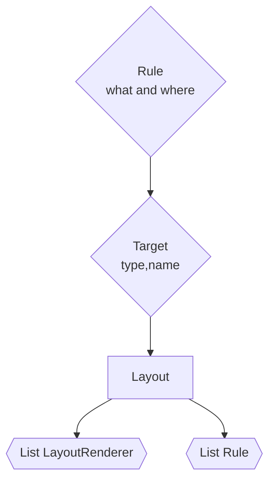

# TODO

* Colored Console  
	- Parse conditions
	- evaluate conditions
	- figure out discrepency between HIghlightRowRUles and _highlightRowRles
	- system logger

* impl File target
* fix bug in layout parser that ignores whitespace in text literals
* make Layout defintions recursive

## Better Defaulst?
	* The CSV/JSON/etc layouts should contain their own version of the SimpleLayout default incl Time,Level,Logger,Message,EventProps

## Mandatory goals
- [ ] implement FileTarget's archival and rotation semantics
- [ ] implement JsonTarget
- [ ]more layout renderers
- [ ]prove implementation of ILogger
- [ ]setup TargetWithLayoutHeaderFooter
- [ ]setup TargetWithLayout
- [ ]change current targets to implement LHF
- [ ]set LFH.closeTarget() to write footer
- [ ]set LFH.initialize() to write header

## Stretch goals
- [ ] implement programatic construction of loggers and log configurations
- [ ] implement runtime reload => trickle down to each logger and layout to reparse its settings

# Targets
Implemented
--
* [Debug](https://github.com/NLog/NLog/wiki/Debug-target)
* [Console](https://github.com/NLog/NLog/wiki/Console-target)

Not Yet Implemented
--
* [ColoredConsole](https://github.com/NLog/NLog/wiki/ColoredConsole-target)
* [File](https://github.com/NLog/NLog/wiki/File-target)
* [Null](https://github.com/NLog/NLog/wiki/Null-target)

Will Not Implememt
--
* [AspNetBufferingWrapper](https://github.com/NLog/NLog/wiki/AspNetBufferingWrapper-target)
* [AsyncWrapper](https://github.com/NLog/NLog/wiki/AsyncWrapper-target)
* [AutoFlushWrapper](https://github.com/NLog/NLog/wiki/AutoFlushWrapper-target)
* [BufferingWrpper](https://github.com/NLog/NLog/wiki/BufferingWrpper-target)
* [Database](https://github.com/NLog/NLog/wiki/Database-target)
* [LiteDB](https://github.com/NLog/NLog/wiki/LiteDB-target)
* [FallbackGroup](https://github.com/NLog/NLog/wiki/FallbackGroup-target)
* [FilteringWrapper](https://github.com/NLog/NLog/wiki/FilteringWrapper-target)
* [LimitingWrapper](https://github.com/NLog/NLog/wiki/LimitingWrapper-target)
* [PostFilteringWrapper](https://github.com/NLog/NLog/wiki/PostFilteringWrapper-target)
* [RandomizeGroup](https://github.com/NLog/NLog/wiki/RandomizeGroup-target)
* [RepeatingWrapper](https://github.com/NLog/NLog/wiki/RepeatingWrapper-target)
* [RetryingWrpper](https://github.com/NLog/NLog/wiki/RetryingWrpper-target)
* [RoundRobinGroup](https://github.com/NLog/NLog/wiki/RoundRobinGroup-target)
* [SplitGroup](https://github.com/NLog/NLog/wiki/SplitGroup-target)
* [AspNetTrace](https://github.com/NLog/NLog/wiki/AspNetTrace-target)
* [Debugger](https://github.com/NLog/NLog/wiki/Debugger-target)
* [DebugSystem](https://github.com/NLog/NLog/wiki/DebugSystem-target)
* [EasyGelf](https://github.com/NLog/NLog/wiki/EasyGelf-target)
* [Elmah](https://github.com/NLog/NLog/wiki/Elmah-target)
* [ETW](https://github.com/NLog/NLog/wiki/ETW-target)
* [Fluentd](https://github.com/NLog/NLog/wiki/Fluentd-target)
* [Gelf](https://github.com/NLog/NLog/wiki/Gelf-target)
* [Gelf4NLog](https://github.com/NLog/NLog/wiki/Gelf4NLog-target)
* [Glimpse](https://github.com/NLog/NLog/wiki/Glimpse-target)
* [MicrosoftDiagnosticSource](https://github.com/NLog/NLog/wiki/MicrosoftDiagnosticSource-target)
* [MSMQ](https://github.com/NLog/NLog/wiki/MSMQ-target)
* [NLog.Gelf](https://github.com/NLog/NLog/wiki/NLog.Gelf-target)
* [NLog.Targets.Grayloghttp](https://github.com/NLog/NLog/wiki/NLog.Targets.Grayloghttp-target)
* [OutputDebugString](https://github.com/NLog/NLog/wiki/OutputDebugString-target)
* [Perfcounter](https://github.com/NLog/NLog/wiki/Perfcounter-target)
* [SignalR](https://github.com/NLog/NLog/wiki/SignalR-target)
* [Trace](https://github.com/NLog/NLog/wiki/Trace-target)
* [Syslog](https://github.com/NLog/NLog/wiki/Syslog-target)
* [Amazon CloudWatch](https://github.com/aws/aws-logging-dotnet)
* [Amazon SNS](https://github.com/Takaloy/NLog.Targets.SNS)
* [Amazon SQS](https://github.com/Takaloy/NLog.Targets.SQS)
* [Blipboard.io](https://github.com/NLog/NLog/wiki/Blipboard.io-target)
* [elmah.io](https://github.com/NLog/NLog/wiki/elmah.io-target)
* [ExceptionLess](https://github.com/NLog/NLog/wiki/ExceptionLess-target)
* [Google Logging](https://github.com/GoogleCloudPlatform/google-cloud-dotnet)
* [LiveSwitch](https://github.com/NLog/NLog/wiki/LiveSwitch-target)
* [LogEntries](https://github.com/NLog/NLog/wiki/LogEntries-target)
* [Loggly](https://github.com/NLog/NLog/wiki/Loggly-target)
* [Logify](https://github.com/NLog/NLog/wiki/Logify-target)
* [Logzio](https://github.com/NLog/NLog/wiki/Logzio-target)
* [Loki](https://github.com/NLog/NLog/wiki/Loki-target)
* [Loupe](https://github.com/NLog/NLog/wiki/Loupe-target)
* [Microsoct Azure AppCenter](https://github.com/NLog/NLog.AzureAppCenter)
* [Microsoft Azure ApplicationInsights](https://github.com/Microsoft/ApplicationInsights-dotnet-logging)
* [Microsoft Azure Blob Storage](https://github.com/JDetmar/NLog.Extensions.AzureStorage/blob/master/src/NLog.Extensions.AzureBlobStorage/README.md)
* [Microsoft Azure DataTables Storage](https://github.com/JDetmar/NLog.Extensions.AzureStorage/blob/master/src/NLog.Extensions.AzureDataTables/README.md)
* [Microsoft Azure EventHubs](https://github.com/JDetmar/NLog.Extensions.AzureStorage/blob/master/src/NLog.Extensions.AzureEventHub/README.md)
* [Microsoft Azure File System](https://github.com/lucianaparaschivei/NLog.Extensions.AzureFileSystem)
* [Microsoft Azure Queue Storage](https://github.com/JDetmar/NLog.Extensions.AzureStorage/blob/master/src/NLog.Extensions.AzureQueueStorage/README.md)
* [Microsoft Azure ServiceBus](https://github.com/JDetmar/NLog.Extensions.AzureStorage/blob/master/src/NLog.Extensions.AzureServiceBus/README.md)
* [Microsoft Azure Table Storage](https://github.com/abkonsta/NLog.Extensions.AzureTableStorage)
* [Pushover](https://github.com/NLog/NLog/wiki/Pushover-target)
* [R7 InsightOps](https://github.com/rapid7/r7insight_dotnet)
* [RavenDB](https://github.com/NLog/NLog/wiki/RavenDB-target)
* [Raygun](https://github.com/NLog/NLog/wiki/Raygun-target)
* [ReflectInsight](https://github.com/NLog/NLog/wiki/ReflectInsight-target)
* [Rollbar.NET](https://github.com/NLog/NLog/wiki/Rollbar.NET-target)
* [Sentry (Raven sdk)](https://github.com/CurtisInstruments/NLog.Targets.Sentry)
* [Sentry (Unified sdk)](https://github.com/getsentry/sentry-dotnet)
* [Seq](https://github.com/NLog/NLog/wiki/Seq-target)
* [StackifyRetrace](https://github.com/NLog/NLog/wiki/StackifyRetrace-target)
* [SumoLogic](https://github.com/NLog/NLog/wiki/SumoLogic-target)
* [Chainsaw](https://github.com/NLog/NLog/wiki/Chainsaw-target)
* [GrowlNotify](https://github.com/NLog/NLog/wiki/GrowlNotify-target)
* [NLogViewer](https://github.com/NLog/NLog/wiki/NLogViewer-target)
* [Memory](https://github.com/NLog/NLog/wiki/Memory-target)
* [MethodCall](https://github.com/NLog/NLog/wiki/MethodCall-target)
* [ImpersonatingWrapper](https://github.com/NLog/NLog/wiki/ImpersonatingWrapper-target)
* [LogReceiverService](https://github.com/NLog/NLog/wiki/LogReceiverService-target)
* [Network](https://github.com/NLog/NLog/wiki/Network-target)
* [WebService](https://github.com/NLog/NLog/wiki/WebService-target)
* [FormControl](https://github.com/NLog/NLog/wiki/FormControl-target)
* [MessageBox](https://github.com/NLog/NLog/wiki/MessageBox-target)
* [RichTextBox](https://github.com/NLog/NLog/wiki/RichTextBox-target)
* [ToolStripItem](https://github.com/NLog/NLog/wiki/ToolStripItem-target)

Undecided
--
* [Mail](https://github.com/NLog/NLog/wiki/Mail-target)
* [MongoDB](https://github.com/NLog/NLog/wiki/MongoDB-target)
* [ElasticSearch](https://github.com/NLog/NLog/wiki/ElasticSearch-target)
* [EventLog](https://github.com/NLog/NLog/wiki/EventLog-target)
* [MicrosoftTeams](https://github.com/NLog/NLog/wiki/MicrosoftTeams-target)
* [RabbitMQ](https://github.com/NLog/NLog/wiki/RabbitMQ-target)
* [Redis](https://github.com/NLog/NLog/wiki/Redis-target)
* [Splunk](https://github.com/NLog/NLog/wiki/Splunk-target)
* [Debug](https://github.com/NLog/NLog/wiki/Debug-target)
* [Http](https://github.com/NLog/NLog/wiki/Http-target)

Non-Standard May Implement
--
* Postgres
* Sqlite
* Slack
* Line

# Layouts

Implemented
--
* [Simple](https://github.com/NLog/NLog/wiki/SimpleLayout)
* [JSON](https://github.com/NLog/NLog/wiki/JsonLayout)
* [CSV](https://github.com/NLog/NLog/wiki/CSVLayout)

Not Yet Implememted
--
* n/a

Will Not Implement
--
* [Gelf](https://github.com/farzadpanahi/NLog.GelfLayout)
* [Xml](https://github.com/NLog/NLog/wiki/XmlLayout)
* [MicrosoftConsoleJsonLayout](https://github.com/NLog/NLog/wiki/MicrosoftConsoleJsonLayout)
* [MicrosoftConsoleLayout](https://github.com/NLog/NLog/wiki/MicrosoftConsoleLayout)

Undecided
--
* [Compound](https://github.com/NLog/NLog/wiki/CompoundLayout)
* [W3CExtendedLogLayout](https://github.com/NLog/NLog/wiki/W3CExtendedLogLayout)
* [Log4JXML](https://github.com/NLog/NLog/wiki/Log4JXmlEventLayout)
* [JsonArray](https://github.com/NLog/NLog/wiki/JsonArrayLayout)

# Layout Renderers

Implemented
--
* [${level}](https://github.com/NLog/NLog/wiki/level-layout-renderer)
* [${literal}](https://github.com/NLog/NLog/wiki/literal-layout-renderer)
* [${newline}](https://github.com/NLog/NLog/wiki/newline-layout-renderer)
* [${loggername}](https://github.com/NLog/NLog/wiki/loggername-layout-renderer)
* [${guid}](https://github.com/NLog/NLog/wiki/guid-layout-renderer)
* [${sequenceid}](https://github.com/NLog/NLog/wiki/sequenceid-layout-renderer)
* [${dir-separator}](https://github.com/NLog/NLog/wiki/dir-separator-layout-renderer)
* [${longdate}](https://github.com/NLog/NLog/wiki/longdate-layout-renderer)
* [${shortdate}](https://github.com/NLog/NLog/wiki/shortdate-layout-renderer)
* [${time}](https://github.com/NLog/NLog/wiki/time-layout-renderer)
* [${hostname}](https://github.com/NLog/NLog/wiki/hostname-layout-renderer)
* [${all-event-properties}](https://github.com/NLog/NLog/wiki/all-event-properties-layout-renderer)
* [${event-property}](https://github.com/NLog/NLog/wiki/event-property-layout-renderer)
* [${message}](https://github.com/NLog/NLog/wiki/message-layout-renderer)
* [${local-ip}](https://github.com/NLog/NLog/wiki/local-ip-layout-renderer)

Not Yet Implemented
--
* [${var}](https://github.com/NLog/NLog/wiki/var-layout-renderer)
* [${callsite}](https://github.com/NLog/NLog/wiki/callsite-layout-renderer)
* [${callsite-filename}](https://github.com/NLog/NLog/wiki/callsite-filename-layout-renderer)
* [${callsite-linenumber}](https://github.com/NLog/NLog/wiki/callsite-linenumber-layout-renderer)
* [${stacktrace}](https://github.com/NLog/NLog/wiki/stacktrace-layout-renderer)
* [${exception}](https://github.com/NLog/NLog/wiki/exception-layout-renderer)
* [${counter}](https://github.com/NLog/NLog/wiki/counter-layout-renderer)
* [${date}](https://github.com/NLog/NLog/wiki/date-layout-renderer)
* [${environment}](https://github.com/NLog/NLog/wiki/environment-layout-renderer)
* [${environment-user}](https://github.com/NLog/NLog/wiki/environment-user-layout-renderer)
* [${assebly-version}](https://github.com/NLog/NLog/wiki/assebly-version-layout-renderer)
* [${cached}](https://github.com/NLog/NLog/wiki/cached-layout-renderer)

Undecided
--
* [${when}](https://github.com/NLog/NLog/wiki/when-layout-renderer)
* [${whenempty}](https://github.com/NLog/NLog/wiki/whenempty-layout-renderer)
* [${onexception}](https://github.com/NLog/NLog/wiki/onexception-layout-renderer)
* [${onhasproperties}](https://github.com/NLog/NLog/wiki/onhasproperties-layout-renderer)
* [${basedir}](https://github.com/NLog/NLog/wiki/basedir-layout-renderer)
* [${currentdir}](https://github.com/NLog/NLog/wiki/currentdir-layout-renderer)
* [${file-contents}](https://github.com/NLog/NLog/wiki/file-contents-layout-renderer)
* [${log4jxmlevent}](https://github.com/NLog/NLog/wiki/log4jxmlevent-layout-renderer)
* [${procesid}](https://github.com/NLog/NLog/wiki/procesid-layout-renderer)
* [${processinfo}](https://github.com/NLog/NLog/wiki/processinfo-layout-renderer)
* [${processname}](https://github.com/NLog/NLog/wiki/processname-layout-renderer)
* [${processlifetime}](https://github.com/NLog/NLog/wiki/processlifetime-layout-renderer)

WIll Not Implement
--
* [${db-null}](https://github.com/NLog/NLog/wiki/db-null-layout-renderer)
* [${object-path}](https://github.com/NLog/NLog/wiki/object-path-layout-renderer)
* [${exceptiondata}](https://github.com/NLog/NLog/wiki/exceptiondata-layout-renderer)
* [${activity}](https://github.com/NLog/NLog/wiki/activity-layout-renderer)
* [${activityid}](https://github.com/NLog/NLog/wiki/activityid-layout-renderer)
* [${gdc}](https://github.com/NLog/NLog/wiki/gdc-layout-renderer)
* [${install-context}](https://github.com/NLog/NLog/wiki/install-context-layout-renderer)
* [${mdc}](https://github.com/NLog/NLog/wiki/mdc-layout-renderer)
* [${mdlc}](https://github.com/NLog/NLog/wiki/mdlc-layout-renderer)
* [${ndc}](https://github.com/NLog/NLog/wiki/ndc-layout-renderer)
* [${ndlc}](https://github.com/NLog/NLog/wiki/ndlc-layout-renderer)
* [${scopenested}](https://github.com/NLog/NLog/wiki/scopenested-layout-renderer)
* [${scopeproperty}](https://github.com/NLog/NLog/wiki/scopeproperty-layout-renderer)
* [${scopetiming}](https://github.com/NLog/NLog/wiki/scopetiming-layout-renderer)
* [${ticks}](https://github.com/NLog/NLog/wiki/ticks-layout-renderer)
* [${json-encode}](https://github.com/NLog/NLog/wiki/json-encode-layout-renderer)
* [${left}](https://github.com/NLog/NLog/wiki/left-layout-renderer)
* [${lowercase}](https://github.com/NLog/NLog/wiki/lowercase-layout-renderer)
* [${norawvalue}](https://github.com/NLog/NLog/wiki/norawvalue-layout-renderer)
* [${pad}](https://github.com/NLog/NLog/wiki/pad-layout-renderer)
* [${replace}](https://github.com/NLog/NLog/wiki/replace-layout-renderer)
* [${replace-newlines}](https://github.com/NLog/NLog/wiki/replace-newlines-layout-renderer)
* [${right}](https://github.com/NLog/NLog/wiki/right-layout-renderer)
* [${rot13}](https://github.com/NLog/NLog/wiki/rot13-layout-renderer)
* [${substring}](https://github.com/NLog/NLog/wiki/substring-layout-renderer)
* [${trim-whitespace}](https://github.com/NLog/NLog/wiki/trim-whitespace-layout-renderer)
* [${uppercase}](https://github.com/NLog/NLog/wiki/uppercase-layout-renderer)
* [${url-encode}](https://github.com/NLog/NLog/wiki/url-encode-layout-renderer)
* [${wrapline}](https://github.com/NLog/NLog/wiki/wrapline-layout-renderer)
* [${xml-encode}](https://github.com/NLog/NLog/wiki/xml-encode-layout-renderer)
* [${appsettings}](https://github.com/NLog/NLog/wiki/appsettings-layout-renderer)
* [${configetting}](https://github.com/NLog/NLog/wiki/configetting-layout-renderer)
* [${registry}](https://github.com/NLog/NLog/wiki/registry-layout-renderer)
* [${filesystem-normalize}](https://github.com/NLog/NLog/wiki/filesystem-normalize-layout-renderer)
* [${nlogdir}](https://github.com/NLog/NLog/wiki/nlogdir-layout-renderer)
* [${processdir}](https://github.com/NLog/NLog/wiki/processdir-layout-renderer)
* [${specialfolder}](https://github.com/NLog/NLog/wiki/specialfolder-layout-renderer)
* [${tempdir}](https://github.com/NLog/NLog/wiki/tempdir-layout-renderer)
* [${identity}](https://github.com/NLog/NLog/wiki/identity-layout-renderer)
* [${windows-identity}](https://github.com/NLog/NLog/wiki/windows-identity-layout-renderer)
* [${gelf}](https://github.com/farzadpanahi/NLog.GelfLayout)
* [${appdomain}](https://github.com/NLog/NLog/wiki/appdomain-layout-renderer)
* [${gc}](https://github.com/NLog/NLog/wiki/gc-layout-renderer)
* [${machinename}](https://github.com/NLog/NLog/wiki/machinename-layout-renderer)
* [${performancecounter}](https://github.com/NLog/NLog/wiki/performancecounter-layout-renderer)
* [${threadid}](https://github.com/NLog/NLog/wiki/threadid-layout-renderer)
* [${threadname}](https://github.com/NLog/NLog/wiki/threadname-layout-renderer)
* [${aspnet-*}](https://github.com/NLog/NLog/wiki/aspnet-*-layout-renderer)

Non-standard may implemented
--
* ${unixtime}

## Architecture

This project is based entirely off NLog, and takes major inspiriation from its architecture.  Although simplified, much of the underlying systems are laid out in the same manner.

## Differences from NLog
### layouts
* Strings must be surrounded by single-quotes  
	- e.g., `${literal:text=hello}` -> `${literal:text='hello'}`
* ASP.NET integrations will not be considered
* Config file is json based, not xml based. Xml parsing will not be consideed at this time
* Some layout renderers that are not in NLog are included here. See also: [${unixtime}](#non-standard-to-be-implemented)
* `${event-property}` layout renderer uses `JSONPath` syntax for nested objects in the `objectpath` property
* requred properties must be in `key=value` form.
	- e.g., `${event-property:item1}` is not permitted. Use `${event-property:item=item1}` instead